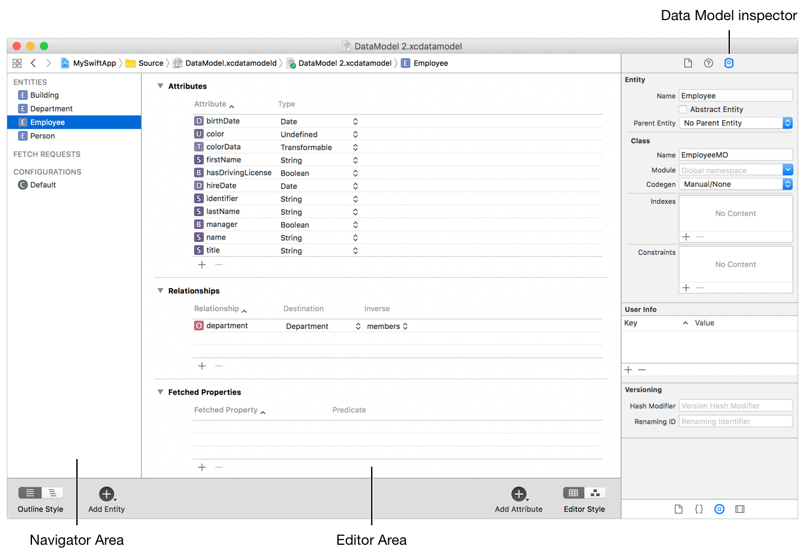
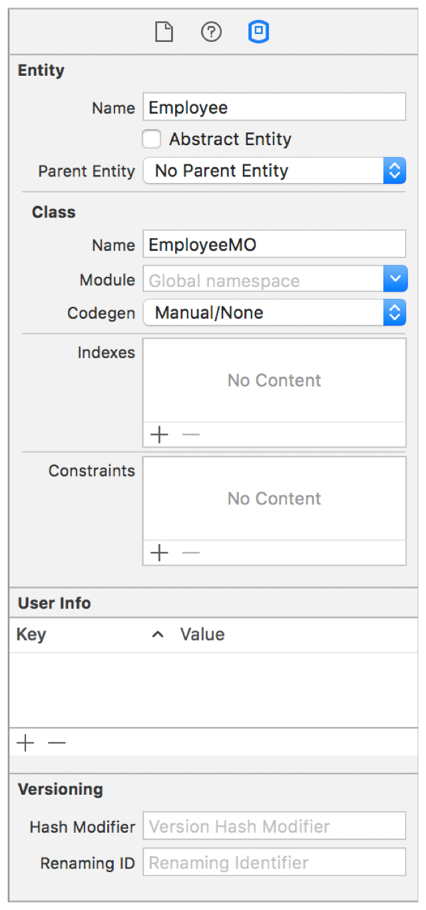
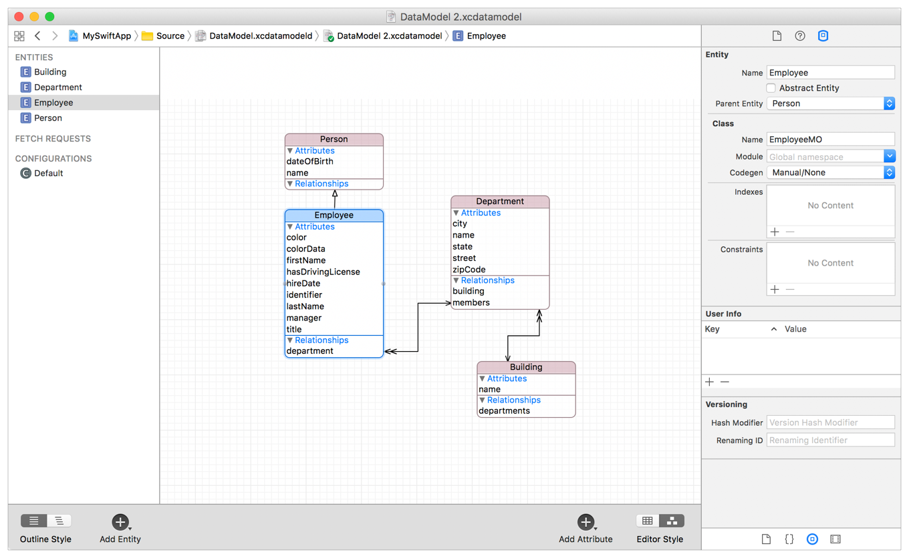
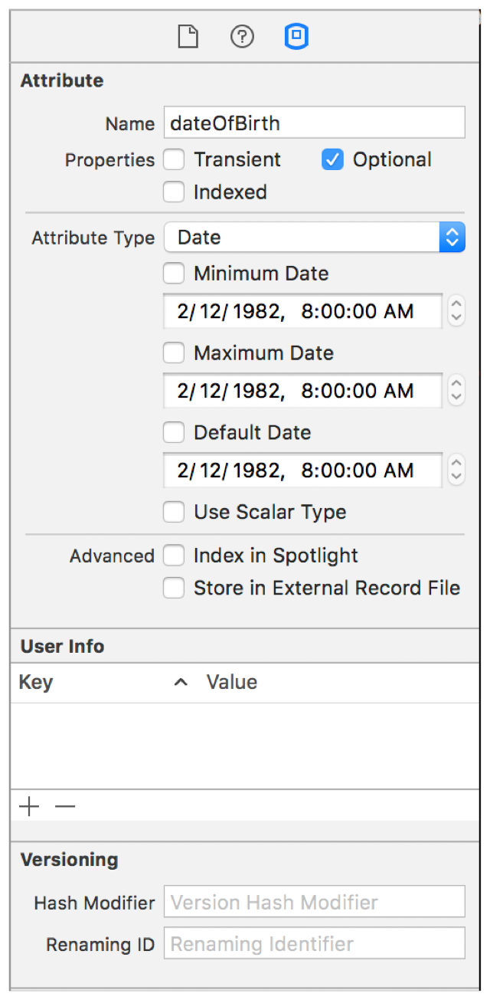

# <center>关于 Entity</center>

## 简述

Entity 的托管对象模型是 NSManagedObjectModel 类的实例。

它描述了三方应用程序中需要使用到的一系列 Entity 以及多个实体之间的关系。

一个模型中可能有很多 NSEntityDescription 实例对象来代表这个模型的各个实例。

对于每个实体来说，有两个很重要的名字:1.这个实体的名字($EntityName);2.在运行时，表示这个实体的类的名字(推荐命名:通常是$EntityNameMO)。

一个实体可能会有属性，关系，也可能有取得属性，这三者统称为属性。需要注意的是，属性不能和NSObject或NSManagedObject已有的方法名重叠，比如，不能给某个财产起名为“描述”。

比较特殊的一种属性叫做瞬态属性，它是不会被保存到持久存储中去的。

多个实体之间可能会有继承关系，也可能某个实体会被指定为抽象的。

大多数model中的元素（比如实体，属性，关系）都会有一个对应的用户信息。



## 详细介绍


### Entity Name VS Entity Name

请注意，Entity Name和Entity Name（NSManagedObject的子类）不同。数据模型中的Entity结构不需要与class层次结构匹配。实体名称和类名称是必填的。 

### Abstract Entities

如果使用过程中不需要创建该实体的任何实例，需要指定实体 Abstract Entities。如果有许多Entity都（继承自）一个本身不应该实例化的公共实体，那么通常会创建一个实体抽象。

### Entity Inheritance



实体继承的工作方式与类继承相似; 如果您有许多相似的实体，则可以将公共属性分解为一个parent实体。可以在一个实体中定义它们，而不是在多个实体中指定相同的属性，然后子实体继承父实体。

```
注意:
使用SQLite持久性存储时，请注意实体继承。从另一个实体继承的所有实体都存在于SQLite的同一个表中。
SQLite持久性存储的设计中的这个因素可能会产生性能问题。
```

### Attributes



关于 properties

- ___transient___,  不会持久化到本地数据库, core data会跟踪transient属性所做的更改，会记录它们以进行撤消操作。可以将瞬态属性用于各种目的，包括存储计算值和派生值。
- ___optional___, it is not required to have a value. 尽量避免这么做, 尤其是对 numeric values, 可以设置一个默认值


```
NOTE

SQL has special comparison behavior for NULL that is unlike Objective-C’s nil.
NULL in a database is not the same as 0, and searches for 0 do not match columns with NULL.
Moreover, NULL in a database is not equivalent to an empty string or empty data blob.


NOTE
If you undo a change to a transient property that uses nonmodeled information,
Core Data does not invoke your set accessor with the old value — it simply updates the snapshot information.
```


### RelationShips

一对一, 一对多, 多对多

delete rules:

- deny:如果至少有一个关系的目的对象存在，源对象是不能被删除的;
- Nullify:在删除当前对象的同时，将关系的目的对象的反向关系设置为空值;
- cascade:在删除当前对象的同时，也删除关系的目的对象;
- No Action:在删除当前对象的同时，对关系的目的对象不做任何操作。在使用这个删除规则的时候，程序员有责任自行维护对象图，所以应该将对应的反向关系设置成有意义的值。


### CodeGen

- Class Definition (两对文件, build时生成, 不可见, 不可更改)
- Catogery/Extension (一对文件, build时生成, 不可见,不可更改)
- Manual/NOne (手动生成, 可见, 可更改)


## 其他

- FETCH REQUESTS
- CONFIGURATIONS
- Fetched Properties


