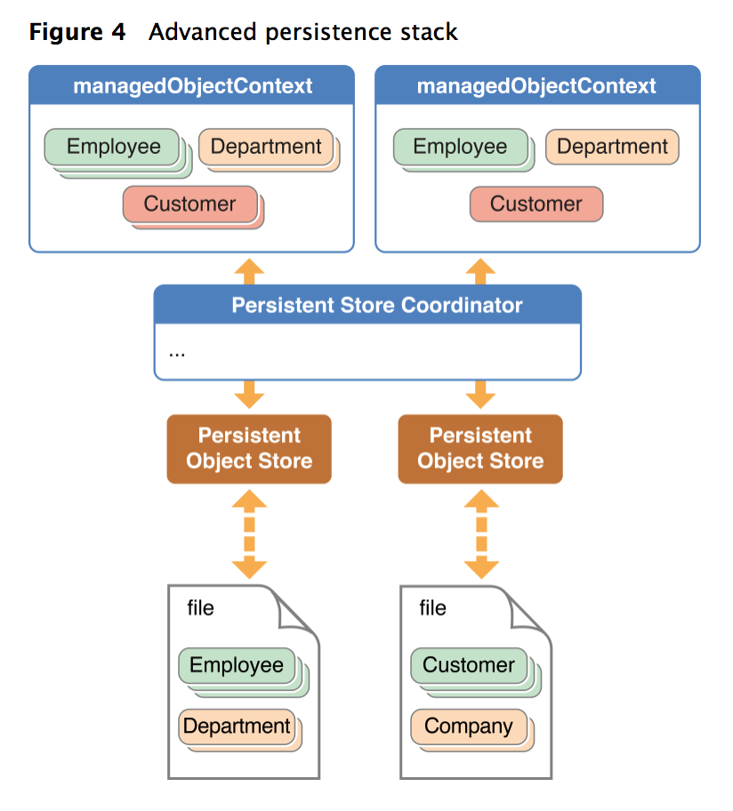

# 
Persistent Stack

## 关于  Persistent Stack
对象和外部数据存储，这两者之间的媒介，被整体叫做Persistent Stack。其中，托管对象上下文(NSManageObjectContext)位于栈顶，持久对象存储(Persistent Onject Store)位于栈底，中间的是持久性存储协调器(Persistent Store Coordinator)。

实际上，Persistent Store Coordinator 决定着这个栈。它使用了[facade模式](https://design-patterns.readthedocs.io/zh_CN/latest/structural_patterns/facade.html)，使得栈底的多个持久存储，在呈现给上下文的时候，就像一个整体一样。
一个协调器只能和一个管理对象模型相关联。

